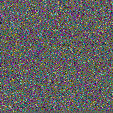
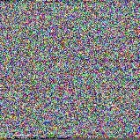
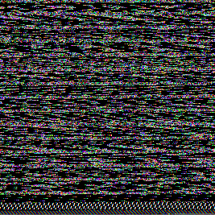
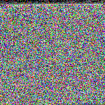

# PNGify

PNGify is command line tool written in Go that allows you to encode text and files into PNG images and decode them back to their original form. This approach blends text and image processing, offering a funny way to store and retrieve data. The goal of this experimental project is to explore creative possibilities.

## Installation

Make sure you have the Go compiler installed on your computer and simply compile this project with `go install`:
```bash
$ go install github.com/tofl/pngify@latest
```

## Usage

### Encode

Use the encode command to convert data into a PNG image. You can use either the `-t` flag to encode text or the `-f` flag to encode a file.

**Encode text:**
```bash
$ pngify encode -t "Your text here"
```

**Encode a file**
```bash
$ pngify encode -f /path/to/file
```

An image with the name `output.png` will pop up in your current directory.

### Decode

Use the decode command to retrieve the original data from a PNG image. You need to provide the path to the PNG image using the `-p` flag.

```bash
$ pngify decode -p /path/to/image.png
```

### Image metadata

The output images have the following metadata:
- Bit Depth: 8 bits
- Color Type: RGB
- Interlace: None
- Filtering: None

## Examples

| <div style="text-align:center; width:200px"><br/>Normal text</div>                        | <div style="text-align:center; width:200px"><br/>A .zip file</div>              |
|-----------------------------------------------------------------------------------------------------------------------|-----------------------------------------------------------------------------------------------------------------------|
| <div style="text-align:center; width:200px"><br/>**A .mov video file**</div> | <div style="text-align:center; width:200px"><br/>**A .webp image file**</div> |

Try decoding these images to see the original files!